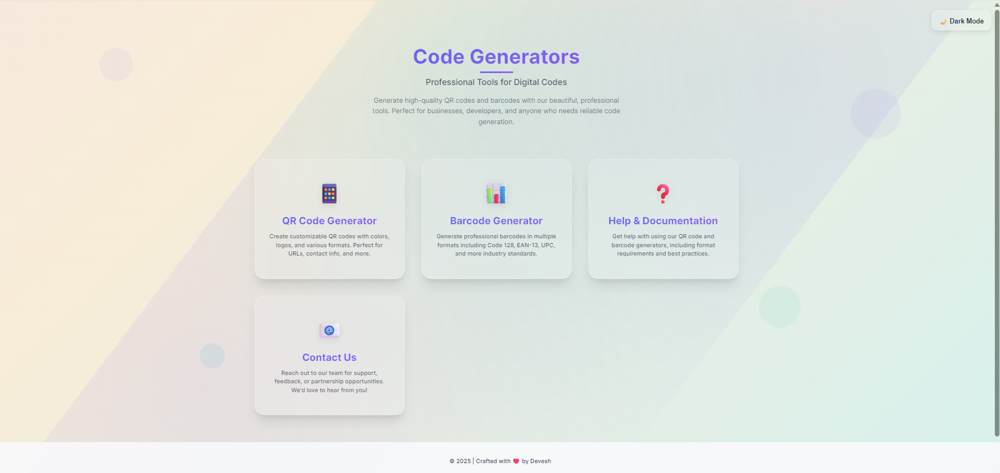
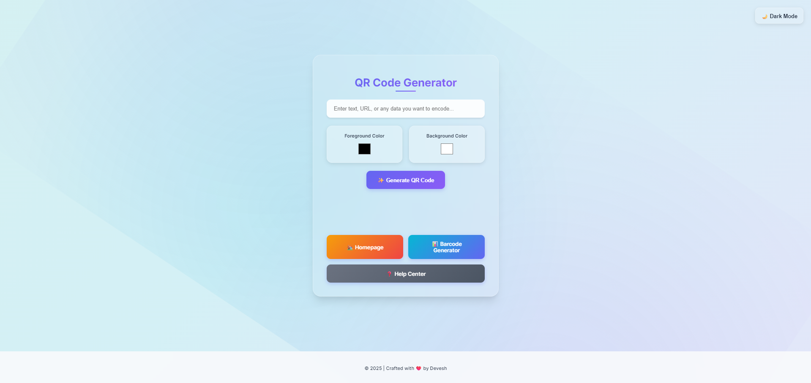
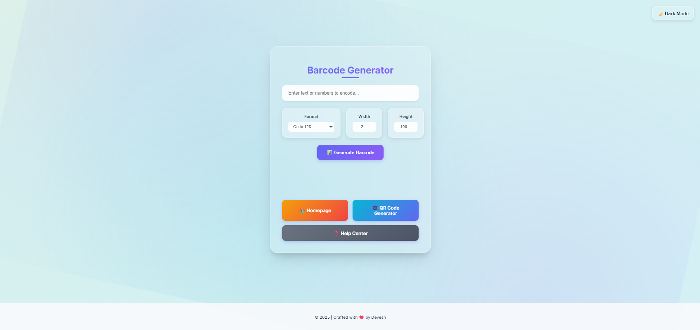

# 🎨 Code Generators – Q-B-G

A sleek and beautiful web-based utility for generating QR codes and barcodes with customizable design, built using HTML, CSS, and JavaScript. Perfect for developers, businesses, and anyone who needs fast, aesthetic code generation tools.

Hosted in: [`Q-B-G`](https://github.com/gigachad1306/Q-B-G)

---

## 🚀 Features

- ✨ Modern glassmorphism design with responsive layout
- 🌙 Dark mode toggle
- 🔳 QR Code generator with custom colors
- 🏷️ Barcode generator with custom size and format
- 📬 Contact page and feedback
- 📚 Help/documentation section

---

## 📸 Screenshots

### 🏠 Homepage


### 📷 QR Code Generator


### 🏷️ Barcode Generator


---

## 📁 File Structure

```text
├── index.html         # Home page
├── qr.html            # QR Code Generator
├── barcode.html       # Barcode Generator
├── contact.html       # Contact / Feedback form
├── help.html          # Help and documentation
├── thank-you.html     # Thank you page after form submission
```

---

## 🛠️ How to Run Locally

```bash
git clone https://github.com/gigachad1306/Q-B-G.git
cd Q-B-G
open index.html  # or double-click to open in browser
```

No build tools required — just HTML/CSS/JS.

---

## 👤 Author

Crafted with ❤️ by **[gigachad1306](https://github.com/gigachad1306)**

---

## 📄 License

This project is licensed under the [MIT License](LICENSE).
